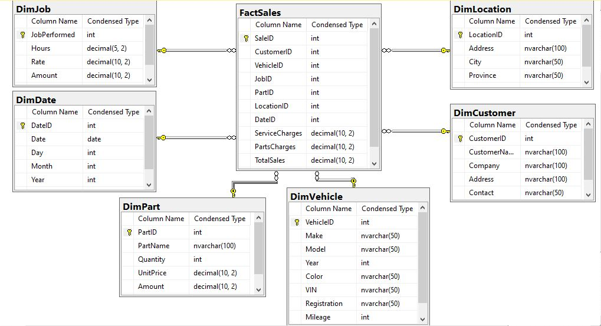

# Dimensional Model for Car Repair Shop Sales Analysis
---

---
## Overview
The task was to perform a comprehensive analysis of a car repair shop’s operations based on a sample [invoice](https://docs.google.com/document/d/1GWZLWDTg1KxTETLqSwvWlzVuAO0laYoMxUEluxwn6Wk/edit?usp=sharing). 
The data includes information about customers, vehicles, jobs performed, parts used, and invoice summaries. 
The goal is to extract meaningful insights using SQL and generate reports that can help the business optimize its operations, improve customer satisfaction, and increase profitability.

## The ER Diagram

## Descriptions of each table and column
### Fact Table: FactSales
This table stores quantitative data related to sales.
#### Columns:
#### -SaleID (Primary Key)
#### -CustomerID (Foreign Key to DimCustomer)
#### -VehicleID (Foreign Key to DimVehicle)
#### -JobPerformed (Foreign Key to DimJob)
#### -PartID (Foreign Key to DimPart)
#### -LocationID (Foreign Key to DimLocation)
#### -DateID (Foreign Key to DimDate)
#### -ServiceCharges (Total labour cost)
#### -PartsCharges (Total parts cost)
#### -TotalSales (Total invoice amount)

### Dimension Tables
#### 1. DimCustomer
#### Description: Stores customer information.
#### Columns:
#### -CustomerID: Primary key, auto-incremented integer.
#### -CustomerName: Name of the customer.
#### -Company: Company name.
#### -Address: Customer address.
#### -Contact: Customer contact number.

#### 2. DimVehicle
#### Description: Stores vehicle information.
#### Columns:
#### -VehicleID: Primary key, auto-incremented integer.
#### -Make: Vehicle’s make.
#### -Model: Vehicle model.
#### -Year: Year of manufacture.
#### -Color: Vehicle color.
#### -VIN: Vehicle Identification Number.
#### -Registration: Vehicle registration number.
#### -Mileage: Vehicle mileage.

#### 3. DimJob
#### Description: Stores job details.
#### Columns:
#### -JobPerformed: Description of Job performed. Primary key, auto-incremented integer.
#### -Hours: Hours spent on the job.
#### -Rate: Hourly rate.
#### -Amount: Calculated as Hours * Rate 
#### 4.DimPart
#### Description: Stores part details.
#### Columns:
#### -PartID: Primary key, auto-incremented integer.
#### -PartNumber: Part number.
#### -PartName: Name of the part.
#### -Quantity: Quantity of parts used.
#### -UnitPrice: Price per unit.
#### -Amount: Calculated as Quantity * UnitPrice

#### 5. DimLocation
#### Description: Stores location information.
#### Columns:
#### -LocationID: Primary key, auto-incremented integer.
#### -Address: Location address.
#### -City: City.
#### -Province: Province.

#### 6. DimDate
#### Description: Stores date information.
#### Columns:
#### -DateID: Primary key, auto-incremented integer.
#### -Date: Date.
#### -Day: Day of the month.
#### -Month: Month.
#### -Year: Year.
---
## Logical Explanation
### -FactSales Table: 
  This table is designed to store all sales transactions, capturing essential details like service charges, parts charges, and total sales to allow comprehensive sales performance analysis.
### -DimCustomer Table: 
  Includes customer-related information to analyze sales by different customer demographics.
### -DimVehicle Table: 
  Captures vehicle details to facilitate analysis of sales by vehicle make, model, and year.
### -DimJob Table: 
  Stores details of jobs performed, allowing analysis of labor costs and job types.
### -DimPart Table: 
  Records information about parts used, enabling analysis of parts sales.
### -DimLocation Table: 
  Contains location information to analyze sales performance by shop locations.
### -DimDate Table: 
  Provides date-related information to analyze sales over time.

---
## Conclusion
The dimensional model for the car repair shop's sales analysis provides a structured approach to capturing and analyzing sales data. 
By organizing the data into fact and dimension tables, the model facilitates detailed analysis of sales performance by customer, vehicle, job type, part, location, and time. 
This model enables the shop to generate comprehensive reports, make informed decisions, optimize operations, and enhance customer satisfaction. 
Overall, it serves as a valuable tool for improving the shop's profitability and efficiency.
